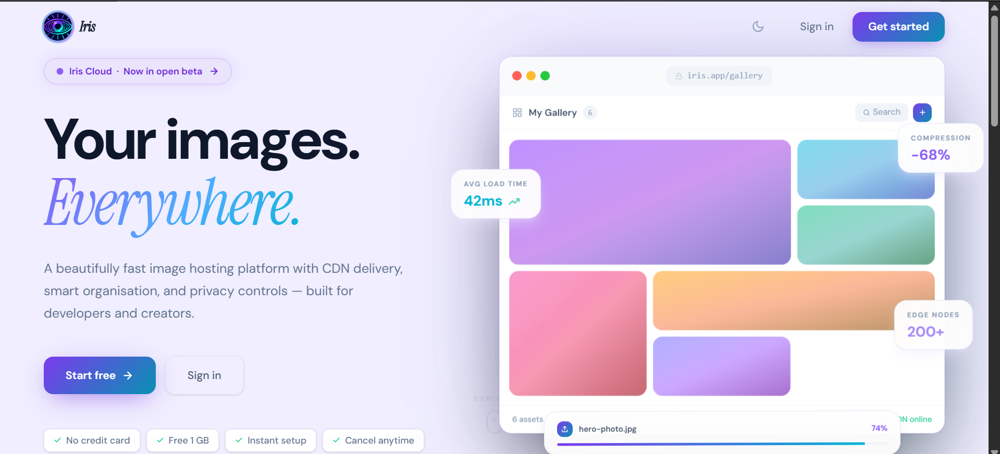

<div align="center">
  
  <h1>Iris — Your Images. Everywhere.</h1>
</div>



> **A beautifully fast image hosting platform with CDN delivery, smart organisation, and privacy controls — built for developers and creators.**

[](https://iris-main-ocga6c.free.laravel.cloud/)
[](https://laravel.com)
[](https://vuejs.org)
[](https://inertiajs.com)
[](https://www.typescriptlang.org)

---

## ✨ What is Iris?

Iris is a **full-stack image hosting SaaS** built on Laravel 13 + Vue 3 + Inertia.js. It gives individuals and teams a private, fast, and beautiful place to upload, organise, share, and deliver images — with enterprise-grade features like expiring links, EXIF stripping, CDN delivery via Imgix/Cloudflare R2, watermarking, compression, and full webhook/API support.

---

## 🚀 Live Demo

**[https://iris-main-ocga6c.free.laravel.cloud/](https://iris-main-ocga6c.free.laravel.cloud/)**

| Credential | Value |
|---|---|
| Email | `test@example.com` |
| Password | `password` |

---

## ⚡ Key Highlights

| Metric | Value |
|---|---|
| **Avg CDN load time** | ~42ms |
| **Compression savings** | Up to −68% file size |
| **Edge nodes (via R2 + Imgix)** | 200+ |
| **Max file size** | 100 MB |
| **Max files per upload** | 20 |
| **Storage plans** | 1 GB Free → 50 GB Pro → 200 GB Team |

---

## 🖼️ Platform Preview


> **Left:** Hero copy with tagline, CTA buttons, and social proof badges (No credit card · Free 1 GB · Instant setup · Cancel anytime)
>
> **Right:** Live gallery UI showing the masonry image grid, real-time upload progress bar (74%), and three floating stat cards:
> - 🟢 **AVG LOAD TIME — 42ms** (CDN-delivered images)
> - 🟣 **COMPRESSION — −68%** (in-browser Canvas compression before upload)
> - 🔵 **EDGE NODES — 200+** (Cloudflare R2 + Imgix global CDN)

---

## 🛠️ Tech Stack

### Backend
| Layer | Technology |
|---|---|
| Framework | Laravel 13.1.1 |
| PHP | 8.5.3 |
| Database | SQLite (dev) / MySQL / PostgreSQL (prod) |
| Queue | Laravel Queue (database driver) |
| Storage | Local / AWS S3 / **Cloudflare R2** |
| Image CDN | **Imgix** (200+ edge nodes) |
| Image Processing | **Cloudinary** / GD (server-side) |
| Auth | Laravel Fortify + 2FA (TOTP) |
| API | Laravel Sanctum + custom API keys |

### Frontend
| Layer | Technology |
|---|---|
| Framework | Vue 3 + TypeScript |
| Routing | Inertia.js |
| Styling | Tailwind CSS + shadcn/ui |
| Charts | Recharts |
| Icons | Lucide Vue |
| Compression | Canvas API (browser-side) |
| EXIF | exifr (dynamic import) |

---

## 📦 Features

### 🖼️ Core Image Management
- **Upload** — drag & drop, clipboard paste (`Ctrl+V`), or click to browse
- **In-browser compression** — Canvas API reduces file size up to 68% before upload
- **EXIF stripping** — GPS, camera data removed server-side on upload
- **Bulk select + ZIP download** — select multiple images, download as `.zip`
- **Bulk delete** — delete multiple images in one action
- **Drag-to-reorder** — custom sort order with `sort_order` column
- **Trash + restore** — soft delete with 30-day bin before permanent removal
- **Scheduled publishing** — set a future `publish_at` date
- **Download counter** — tracks how many times each image has been downloaded
- **Caption + alt text** — editable metadata on every image
- **Image versioning** — re-upload replaces but keeps old version accessible

### 🔗 Sharing
- **Expiring links** — create links that auto-expire (1 hour → 30 days)
- **Password-protected links** — bcrypt-hashed password on shared links
- **View history** — IP (masked), browser, and timestamp logged per view
- **Public embed codes** — ``, BBCode, and Markdown snippets
- **Public image URLs** — imgur-style direct links at `/i/{token}`
- **Social media preview cards** — Open Graph + Twitter Card meta tags

### 🏷️ Organisation
- **Albums** — group images into named collections with cover image
- **Password-protected albums** — lock albums behind a password
- **Tags** — tag images, search and filter by tag
- **Batch tag editor** — apply tags to multiple images at once
- **Search** — full-text search across name, caption, alt text, and tags
- **Image EXIF viewer** — display camera make/model, GPS, ISO, aperture inline

### 📊 Analytics & Dashboard
- **Upload history chart** — bar chart of uploads per day (last 30 days)
- **Storage trend** — line chart of cumulative storage growth
- **Link views chart** — line chart of shared link views per day
- **Stats cards** — total images, total links, downloads, storage used

### 👤 Profiles
- **Public profile page** — `/@username` with avatar, bio, and public gallery
- **Avatar upload** — stored on configured disk (local/R2/S3)
- **Username** — unique, URL-safe handle


## 🗂️ Project Structure

```
iris/
├── app/
│   ├── Http/
│   │   ├── Controllers/        # ImageController, AlbumController, etc.
│   │   ├── Middleware/         # CheckStorageLimit, AdminMiddleware, CheckIpAllowlist
│   │   ├── Requests/           # ImageUploadRequest, SharedLinkRequest
│   │   └── Resources/          # ImageResource, SharedLinkResource, UserResource
│   ├── Models/                 # Image, Album, Tag, SharedLink, Webhook, ApiKey...
│   ├── Services/               # ImageService, ZipService, WatermarkService,
│   │                           # ImgixService, CloudinaryService, WebhookService...
│   └── Mail/                   # InvitationMail, StorageWarningMail, DigestMail
├── config/
│   ├── iris.php                # All Iris-specific config (plans, drivers, Imgix, Cloudinary)
│   └── filesystems.php         # Local, S3, and R2 disk configs
├── database/
│   ├── migrations/             # 15+ migrations
│   └── seeders/                # PlanSeeder, DatabaseSeeder
├── resources/js/
│   ├── composables/            # useUpload, useCompression, useExif, useSharedLink
│   ├── components/
│   │   ├── Upload/             # DropZone, UploadProgress, FilePreview, CompressionOptions
│   │   ├── Gallery/            # ImageCard, ImageGrid, ImageLightbox
│   │   ├── Shared/             # ExpiringLinkModal, ShareButton
│   │   ├── Plans/              # PlanCard, PlanBadge
│   │   └── Admin/              # StatsCard, UserTable
│   ├── pages/
│   │   ├── images/             # Index, Create, Show, Trash
│   │   ├── shared-links/       # Index, Create
│   │   ├── albums/             # Index, Show, Create
│   │   ├── settings/           # Webhooks, ApiKeys, Profile
│   │   └── admin/              # Index, Users/Index, Users/Show
│   └── stores/                 # useImageStore, useAuthStore
└── routes/
    ├── web.php                 # All app routes
    └── admin.php               # Admin-only routes
```

---

## 🚀 Installation

### Requirements
- PHP 8.2+
- Composer
- Node.js 18+
- SQLite / MySQL / PostgreSQL
- ZipArchive PHP extension (for bulk download)
- GD PHP extension (for watermarking and format conversion)

### Quick Start

```bash
# Clone
git clone https://github.com/yourname/iris.git
cd iris

# Install PHP dependencies
composer install

# Install JS dependencies
npm install

# Environment setup
cp .env.example .env
php artisan key:generate

# Database
php artisan migrate --seed

# Storage link
php artisan storage:link

# Build assets
npm run build

# Serve
php artisan serve
```

### Default credentials (after seeding)
```
Email:    test@example.com
Password: password
```

---

## ⚙️ Configuration

### Storage drivers (`.env`)
```env
# Local (default for development)
IRIS_STORAGE_DISK=public

# Cloudflare R2 (recommended for production)
IRIS_STORAGE_DISK=r2
R2_ACCESS_KEY_ID=your_key
R2_SECRET_ACCESS_KEY=your_secret
R2_BUCKET=iris-images
R2_ENDPOINT=https://<ACCOUNT_ID>.r2.cloudflarestorage.com
R2_PUBLIC_URL=https://pub-<hash>.r2.dev

# AWS S3
IRIS_STORAGE_DISK=s3
AWS_ACCESS_KEY_ID=your_key
AWS_SECRET_ACCESS_KEY=your_secret
AWS_DEFAULT_REGION=us-east-1
AWS_BUCKET=iris-images
```


### Recommended production setup
```env
IRIS_STORAGE_DISK=r2      # Store on R2
IMGIX_ENABLED=true         # Serve via Imgix CDN
CLOUDINARY_ENABLED=false   # Imgix handles transforms
```

---

## 📡 API

Iris has a REST API authenticated via API key.

```bash
# Set your API key
export IRIS_KEY="iris_xxxxxxxxxxxxxxxxxxxx"

# List images
curl https://iris-main-ocga6c.free.laravel.cloud/api/images \
  -H "Authorization: Bearer $IRIS_KEY"

# Upload an image
curl -X POST https://iris-main-ocga6c.free.laravel.cloud/api/images \
  -H "Authorization: Bearer $IRIS_KEY" \
  -F "image=@photo.jpg"

# Create a shared link
curl -X POST https://iris-main-ocga6c.free.laravel.cloud/api/shared-links \
  -H "Authorization: Bearer $IRIS_KEY" \
  -H "Content-Type: application/json" \
  -d '{"image_id": 1, "expires_in": 24}'
```

---

## 🔗 Plans

| | Free | Pro | Team |
|---|---|---|---|
| Storage | 1 GB | 50 GB | 200 GB |
| Price | $0/mo | $9/mo | $29/mo |
| Expiring links | ✗ | ✓ | ✓ |
| Password-protected links | ✗ | ✓ | ✓ |
| View history | ✗ | ✓ | ✓ |
| Team folders | ✗ | ✗ | ✓ |
| Admin dashboard | ✗ | ✗ | ✓ |
| Priority support | ✗ | ✗ | ✓ |

---

## 🤝 Contributing

Pull requests are welcome. For major changes, please open an issue first.

```bash
# Development
npm run dev
php artisan serve

# Tests
php artisan test

# Code style
./vendor/bin/pint
```
---
# Security & Enterprise Access Control

Full implementation of role-based access control (RBAC), IP allowlisting,
SAML 2.0 SSO and LDAP/Active Directory authentication for Iris.

---

## What's in this group

| Area | Files |
|---|---|
| **RBAC — Roles & Permissions** | `Role`, `RbacService`, `RoleController`, `RoleResource`, `RoleSeeder` |
| **IP Allowlist** | `IpAllowlistEntry`, `IpAllowlistService`, `IpAllowlistController`, `EnforceIpAllowlist` middleware |
| **SAML 2.0 SSO** | `SamlIdentityProvider`, `SamlService`, `SamlController`, `Saml2LoginListener` |
| **LDAP / AD** | `LdapService`, `LdapLoginController`, `config/ldap.php` |
| **Middleware** | `EnforceIpAllowlist`, `RequirePermission` |
| **Migrations** | roles, role_user, ip_allowlist_entries, saml_identity_providers, users (SSO columns) |
| **Vue pages** | `Admin/Roles/Index.vue`, `Settings/IpAllowlist/Index.vue` |

---

## 1. RBAC — Roles & Permissions

### How it works

Permissions are plain strings like `images.upload` or `admin.manage_users`.
Roles hold a JSON array of permissions. Users belong to many roles via the
`role_user` pivot. Admin users (`is_admin = true`) bypass all permission checks.

### All permissions

Defined as a constant on the `Role` model:

```
images.upload        images.delete       images.download
images.replace       images.reorder      images.bulk
links.create         links.delete        links.view_stats
albums.create        albums.delete       albums.manage_images
tags.create          tags.delete
api_keys.manage      api_credentials.manage
webhooks.manage
polls.create         polls.delete
admin.access         admin.manage_users  admin.manage_roles
admin.manage_plans   admin.email_templates
```

Use `*` as a wildcard to grant everything (used by the system `admin` role).

### Checking permissions in controllers / code

```php
// Via RbacService (injected)
$this->rbacService->check($user, 'images.upload');

// Via User model helper (after adding Group H additions)
$user->hasPermission('images.upload');
$user->hasRole('editor');
```

### Gating routes with the middleware

Register `RequirePermission` as `permission` in `app/Http/Kernel.php`:

```php
// In $routeMiddleware:
'permission' => \App\Http\Middleware\RequirePermission::class,
```

Then use it on routes:

```php
Route::post('/images', [ImageController::class, 'store'])
    ->middleware('permission:images.upload');
```

### System roles

Three system roles are seeded and **cannot be deleted**:

| Role | Slug | Description |
|---|---|---|
| Administrator | `admin` | Wildcard — all permissions |
| Editor | `editor` | Full image/link/album management, no admin panel |
| Viewer | `viewer` | Download and view stats only |

---

## 2. IP Allowlist

Users can restrict their account to specific IP ranges. When enabled, any
request from an unlisted IP terminates the session and redirects to login.

### Enable the middleware

Add `EnforceIpAllowlist` to the `web` middleware group **after** `auth` in
`app/Http/Kernel.php`:

```php
\App\Http\Middleware\EnforceIpAllowlist::class,
```

### CIDR examples

| Entry | Matches |
|---|---|
| `203.0.113.42/32` | Single IPv4 address |
| `192.168.1.0/24` | 192.168.1.0 – 192.168.1.255 |
| `10.0.0.0/8` | Entire 10.x.x.x block |
| `2001:db8::/32` | IPv6 range |

The settings page always shows the user's current IP with a one-click
"Add this IP" button to prevent accidental lockout.

---

## 3. SAML 2.0 SSO

Iris uses the [`aacotroneo/laravel-saml2`](https://github.com/aacotroneo/laravel-saml2)
package. Each tenant can configure their own IdP (Okta, Azure AD, ADFS, etc.)
via the `saml_identity_providers` database table.

### Installation

```bash
composer require aacotroneo/laravel-saml2
php artisan vendor:publish --provider="Aacotroneo\Saml2\Saml2ServiceProvider"
```

### Flow

```
User clicks "Sign in with SSO"
  → GET /sso/login          (SamlController@loginPage — lists available IdPs)
  → Redirect to IdP SSO URL (package handles /saml2/{idpName}/login)
  → IdP posts assertion to  /saml2/{idpName}/acs
  → Package fires SignedIn event
  → Saml2LoginListener resolves IdP from database
  → SamlService::loginFromAssertion() finds-or-creates user, calls Auth::login()
  → Redirect to /dashboard
```

### Registering an IdP

Insert a row into `saml_identity_providers` (or build an admin UI):

```php
SamlIdentityProvider::create([
    'user_id'         => $tenantOwner->id,
    'name'            => 'Okta',
    'idp_name'        => 'acme-corp',           // must be URL-safe, unique
    'entity_id'       => 'http://www.okta.com/exkXXXXX',
    'sso_url'         => 'https://acme.okta.com/app/xxx/sso/saml',
    'x509_cert'       => '-----BEGIN CERTIFICATE-----....',
    'email_attribute' => 'email',
    'name_attribute'  => 'name',
    'active'          => true,
]);
```

Your SP metadata URL will be: `https://yourdomain.com/saml2/{idpName}/metadata`

---

## 4. LDAP / Active Directory

### Configuration

Copy these to your `.env`:

```env
LDAP_HOST=ldap://dc.example.com
LDAP_PORT=389
LDAP_BASE_DN="dc=example,dc=com"
LDAP_BIND_DN="cn=svc-iris,ou=service-accounts,dc=example,dc=com"
LDAP_BIND_PASSWORD=your-service-account-password
LDAP_USER_FILTER=(sAMAccountName={username})   # AD format
# LDAP_USER_FILTER=(uid={username})            # OpenLDAP format
```

### Login endpoint

```
POST /ldap/login
Body: { username, password }
```

The controller calls `LdapService::authenticate()`, which:

1. Connects to the LDAP server
2. Binds with the service account to search for the user
3. Verifies the user's own password via a second bind
4. Finds or creates a local `User` record (provisioning)
5. Calls `Auth::login()`

The LDAP login form can be added to any page — a minimal example:

```vue
<form @submit.prevent="form.post('/ldap/login')">
    <Input v-model="form.username" placeholder="Username (sAMAccountName)" />
    <Input v-model="form.password" type="password" placeholder="Password" />
    <Button type="submit">Sign in with Active Directory</Button>
</form>
```

---

## 5. Kernel / middleware registration

Add to `app/Http/Kernel.php`:

```php
// In $routeMiddleware:
'permission' => \App\Http\Middleware\RequirePermission::class,
'ip.allowlist' => \App\Http\Middleware\EnforceIpAllowlist::class,
```

Add `EnforceIpAllowlist` to the `web` group middleware stack (after `auth`):

```php
protected $middlewareGroups = [
    'web' => [
        // ... existing middleware ...
        \App\Http\Middleware\EnforceIpAllowlist::class,
    ],
];
```

---

## 6. Migrations (run in order)

```bash
php artisan migrate
```

| File | Creates |
|---|---|
| `000001_create_roles_table` | `roles` |
| `000002_create_role_user_table` | `role_user` pivot |
| `000003_create_ip_allowlist_entries_table` | `ip_allowlist_entries` |
| `000004_create_saml_identity_providers_table` | `saml_identity_providers` |
| `000005_add_sso_ip_columns_to_users_table` | `sso_provider`, `sso_id`, `ldap_dn`, `ip_allowlist_enabled`, `last_login_ip` on `users` |

---

## 7. Seeding

```bash
php artisan db:seed --class=RoleSeeder
```

Seeds the three system roles (Administrator, Editor, Viewer).

---

## 8. Sidebar navigation

Add these entries to `AppSidebar.vue` to surface the new settings:

```ts
// In mainNavItems (authenticated users):
{ title: 'IP Allowlist', href: '/settings/ip-allowlist', icon: Shield },

// In adminNavItems (admin only):
{ title: 'Roles', href: '/admin/roles', icon: ShieldCheck },
```

---

## 9. User model additions

Merge `app/Models/UserGroupHAdditions.php` into the existing `User` model:

- Add `roles()`, `ipAllowlistEntries()`, `samlProviders()` relationships
- Add `hasRole()`, `hasPermission()`, `isIpAllowed()` helpers
- Add columns to `$fillable` and `$casts` as indicated in the file

---

## Composer dependencies

```bash
composer require aacotroneo/laravel-saml2   # SAML 2.0 SSO
# php-ldap extension is required for LDAP (usually already available)
```

---
# Security & API

Complete implementation across six features. All files follow the existing Iris conventions (Inertia/Vue 3, Laravel 11, shadcn-vue, Tailwind, Sanctum).

---

## Feature 1 — Two-Factor Authentication (2FA)
Uses the existing `Laravel\Fortify` TOTP pipeline already wired in `SecurityController.php` and `Security.vue`. No new backend files required — Fortify handles QR generation, confirmation, recovery codes, and the login challenge step.

**Key files (already in codebase):**
- `app/Http/Controllers/Settings/SecurityController.php`
- `resources/js/pages/settings/Security.vue`
- `resources/js/components/TwoFactorSetupModal.vue`
- `resources/js/components/TwoFactorRecoveryCodes.vue`

---

## Feature 2 — API Key Management (Sanctum Bearer tokens)
Already fully implemented. New files are not needed.

**Key files (already in codebase):**
- `app/Http/Controllers/ApiKeyController.php`
- `resources/js/pages/settings/ApiKeys.vue`
- Routes in `routes/web.php` under `/settings/api-keys`

---

## Feature 3 — SAML SSO (Enterprise)

**New files:**
| File | Purpose |
|------|---------|
| `app/Http/Controllers/SamlController.php` | Handles `Saml2LoginEvent`, syncs/creates local User, logs in via `Auth::login()`. Also serves the SSO landing page. |
| `resources/js/pages/auth/SsoLogin.vue` | Enterprise SSO entry page with IdP redirect button. |
| `routes/group-h.php` | Registers `/sso/login` route. |

**Package:** `composer require aacotroneo/laravel-saml2`

**Config steps:**
1. Publish config: `php artisan vendor:publish --tag=saml2_config`
2. Set `SAML2_*` env vars (entity ID, ACS URL, IdP metadata URL)
3. Register `SamlController@handleLogin` as a listener for `Saml2LoginEvent` in `EventServiceProvider`

---

## Feature 4 — LDAP / Active Directory

**New files:**
| File | Purpose |
|------|---------|
| `app/Http/Controllers/Auth/LdapLoginController.php` | Attempts LDAP bind; on success syncs/creates local User; falls back to Eloquent auth if LDAP is unreachable. |
| `routes/group-h.php` | Registers `POST /ldap/login` route. |

**Package:** `composer require directorytree/ldaprecord-laravel`

**Config steps:**
1. Publish config: `php artisan vendor:publish --provider="LdapRecord\Laravel\LdapAuthServiceProvider"`
2. Set `LDAP_HOST`, `LDAP_BASE_DN`, `LDAP_USERNAME`, `LDAP_PASSWORD` in `.env`
3. Optionally wire Fortify to use `LdapLoginController@login` as the `authenticateUsing` callback

---

## Feature 5 — IP-Based Access Control

**New files:**
| File | Purpose |
|------|---------|
| `app/Http/Middleware/CheckIpAllowlist.php` | Reads `user->ip_allowlist` (JSON array), checks `request()->ip()` against entries. Supports IPv4, IPv6, and CIDR ranges. |
| `app/Http/Controllers/Settings/IpAllowlistController.php` | CRUD for the per-user allowlist. |
| `resources/js/pages/settings/IpAllowlist.vue` | Settings page with add/remove UI, CIDR badge, format guide. |
| `database/migrations/…add_ip_allowlist_to_users_table.php` | Adds `ip_allowlist JSON NULL` column. |
| `routes/group-h.php` | Registers `GET/PUT /settings/ip-allowlist`. |

**Registration:** Add `CheckIpAllowlist` to the `auth` middleware group in `bootstrap/app.php`:
```php
->withMiddleware(function (Middleware $middleware) {
    $middleware->appendToGroup('auth', \App\Http\Middleware\CheckIpAllowlist::class);
})
```

Also add `ip_allowlist` to the User model's `$casts`:
```php
protected $casts = [
    'ip_allowlist' => 'array',
    // …
];
```

---

## Feature 6 — Custom Roles & Permissions (RBAC)

**New files:**
| File | Purpose |
|------|---------|
| `app/Models/Role.php` | Eloquent model with `permissions()` and `users()` many-to-many relations. |
| `app/Models/Permission.php` | Eloquent model. |
| `app/Concerns/HasRoles.php` | Trait for User model — `can()`, `canAll()`, `canAny()`, `hasRole()`, `assignRole()`, `removeRole()`. Admins bypass all checks. |
| `app/Http/Controllers/Admin/RoleController.php` | Admin CRUD for roles + permission sync + assign/revoke on users. |
| `resources/js/pages/admin/Roles/Index.vue` | Full role manager with create/edit/delete dialogs and permission matrix grouped by category. |
| `resources/js/pages/admin/Users/Show.vue` | Extended with role assignment panel (assign/revoke per-role). |
| `database/migrations/…create_roles_and_permissions_tables.php` | Creates `roles`, `permissions`, `role_permission`, `role_user` tables. |
| `database/seeders/RolesAndPermissionsSeeder.php` | Seeds four built-in roles (admin, moderator, uploader, viewer) with correct permission sets. |
| `routes/group-h.php` | Registers `/admin/roles` CRUD + `/admin/users/{user}/roles` assign/revoke. |

**Integration steps:**

1. Add `HasRoles` trait to `User` model:
```php
use App\Concerns\HasRoles;

class User extends Authenticatable
{
    use HasRoles, HasApiTokens, /* … */;
}
```

2. Run migrations & seeder:
```bash
php artisan migrate
php artisan db:seed --class=RolesAndPermissionsSeeder
```

3. Add Roles link to admin sidebar in `AppSidebar.vue`:
```vue
{ title: 'Roles', href: '/admin/roles', icon: ShieldCheck },
```

4. Pass `roles` and `userRoles` from `UserController@show`:
```php
public function show(User $user): Response
{
    $user->load('plan', 'roles')->loadCount('images');
    return Inertia::render('admin/Users/Show', [
        'user'      => new UserResource($user),
        'images'    => $user->images()->latest()->paginate(12),
        'roles'     => Role::select('id', 'name', 'label')->get(),
        'userRoles' => $user->roles->map->only('id','name','label'),
    ]);
}
```

5. Use `@can` in Blade or `user.can('permission.name')` via shared Inertia props for frontend gates.

---

## Routes summary (routes/group-h.php)

```
GET  /sso/login                              → SamlController@loginPage
POST /ldap/login                             → LdapLoginController@login

GET  /settings/ip-allowlist                  → IpAllowlistController@edit
PUT  /settings/ip-allowlist                  → IpAllowlistController@update

GET    /admin/roles                          → RoleController@index
POST   /admin/roles                          → RoleController@store
PUT    /admin/roles/{role}                   → RoleController@update
DELETE /admin/roles/{role}                   → RoleController@destroy
POST   /admin/users/{user}/roles             → RoleController@assignToUser
DELETE /admin/users/{user}/roles             → RoleController@revokeFromUser
```
---
## 📄 License

MIT — see [LICENSE](LICENSE) for details.

---

<div align="center">

Built with ❤️ using **Laravel** + **Vue 3** + **Inertia.js**

**[🌐 Live Demo](https://iris-main-ocga6c.free.laravel.cloud/)** · **[📖 Docs](https://iris-main-ocga6c.free.laravel.cloud/docs)** · **[🐛 Issues](https://github.com/yourname/iris/issues)**

</div>
